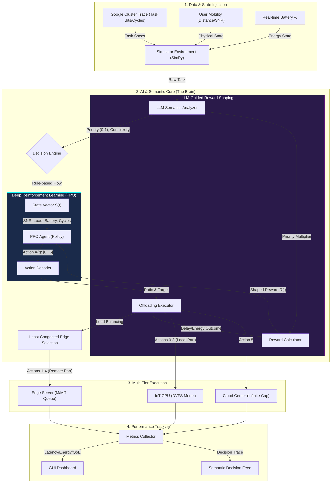

PROJE RAPORU: Yeni Nesil Kenar Ağlarında LLM Yönlendirmeli Derin Pekiştirmeli Öğrenme ile Semantik Odaklı Görev Boşaltma (Task Offloading) ve Dinamik Kaynak Tahsisi

1. Giriş ve Motivasyon
Nesnelerin İnterneti (IoT) cihazlarının ürettiği veri hacmi ve işlem yükü son yıllarda katlanarak artmaktadır. Akıllı şehirler, otonom araçlar, endüstri 4.0 uygulamaları ve giyilebilir sağlık cihazları gibi alanlarda üretilen bu görev akışlarını geleneksel bulut bilişim (Cloud Computing) mimarileri aracılığıyla yönetmek, yüksek iletim gecikmesi (latency) ve bant genişliği (bandwidth) darboğazları nedeniyle giderek sürdürülemez hale gelmektedir. Bu soruna yanıt olarak Kenar Bilişim (Edge Computing) ve Görev Boşaltma (Task Offloading) stratejileri literatürde yaygın biçimde araştırılmaktadır; ancak incelediğimiz çalışmaların %90'ından fazlası, cihazlardan gelen görevleri yalnızca "bit sayısı" ve "CPU döngüsü" gibi donanımsal (hardware-centric) metrikler üzerinden değerlendirmektedir. Bu yaklaşım, birbirinden temelden farklı iki görevi —örneğin, bir ameliyathaneden gelen anlık sağlık alarmı ile rutin bir ortam sıcaklığı logu— tamamen aynı şekilde ele alarak kritik semantik (anlamsal) bağlamı göz ardı etmektedir.

Bu çalışmanın temel motivasyonu, söz konusu semantik farkındalık eksikliğinin yanı sıra literatürde tespit edilen iki ek kritik boşluktan doğmaktadır: (1) mevcut DRL tabanlı çözümlerin büyük çoğunluğu kısmi boşaltma (Partial Offloading) seçeneğini ya hiç sunmamakta ya da iki uçlu (binary: tümü cihazda veya tümü bulutta) kararlarla sınırlı kalmakta; (2) geleneksel modeller eğitildikleri ağ ortamına aşırı uyum (overfit) sağlayarak ortam dinamikleri değiştiğinde başarısız olmaktadır. Bu üç boşluğu tek bir çerçevede kapatmak amacıyla, Büyük Dil Modellerinin (LLM) sıfır-örnek (zero-shot) anlamsal çıkarım yeteneklerini, Proximal Policy Optimization (PPO) algoritmasının dinamik ve sürekli karar verme gücüyle birleştiren yeni nesil bir "Semantik Odaklı (Semantic-Aware) Görev Boşaltma ve Dinamik Kaynak Tahsisi" orkestrasyon sistemi tasarlanmış ve geliştirilmiştir.

Önerilen sistemde her gelen görev; önce hafifletilmiş bir LLM (TinyLlama/Llama-2) tarafından içeriğine, aciliyetine (urgency) ve karmaşıklığına (complexity) göre semantik olarak puanlanmakta, ardından bu meta-veriler PPO ajanının durum uzayına (observation space) eklenmektedir. Ajan bu zenginleştirilmiş durumu kullanarak görevi %0 (Tamamı Cihazda / Local), %25, %50, %75 veya %100 (Tamamı Bulut) oranlarında en uygun katmana —Cihaz, Kenar veya Bulut— dinamik biçimde aktarmaktadır. Bu sayede sistem; gecikme, enerji tüketimi ve semantik öncelik kriterlerini eş zamanlı olarak optimize eden, genellenebilir ve içerik duyarlı bir görev orkestrasyon altyapısı sunmaktadır.

2. Kullanılan Veri Setleri
Projenin simülasyon aşamasında gerçek dünya geçerliliğini (real-world validity) sağlamak adına sentetik rastgele dağılımlar yerine endüstri standardı iki temel veri seti kullanılmıştır. Bu tercih, hem görev özelliklerinin hem de cihaz hareketliliğinin gerçekçi bir dağılımla modellenmesine imkân tanımakta; böylece önerilen mimarinin laboratuvar koşullarının ötesinde genel geçer (generalizable) sonuçlar ürettiği doğrulanabilmektedir.

**İş Yükü (Workload) Verisi — Google Cluster Trace**
Google'ın büyük ölçekli veri merkezlerinden derlenen bu iz (trace) verisi, binlerce gerçek iş yükünün geliş zamanı (arrival time), CPU döngüsü ihtiyacı (cycles) ve veri boyutu (bits) gibi temel özelliklerini içermektedir. Simülasyonda üretilen her görev (task), bu iz verisindeki dağılımlardan örnekleme yapılarak oluşturulmakta; bu sayede sadece Poisson süreciyle modellenmiş yapay görev gelişlerinin yerine gerçek trafik desenleri kullanılmaktadır. Sonuç olarak simülasyona giren görevlerin heterojenliği (boyut, hesaplama yükü, tip) gerçek bir veri merkezi ortamını yansıtmaktadır.

**Kullanıcı Hareketliliği (Mobility) Verisi — Didi Gaia (Ride-Hailing Dataset)**
Çin kökenli bu araç-hailing veri seti; araçların, dronların ve mobil kullanıcıların koordinat bazlı gerçek rotalarını içermektedir. Simülasyon süresi boyunca her cihazın anlık konumu bu rota verilerinden türetilmekte; cihazın en yakın Kenar (Edge) sunucusuna olan mesafesi sürekli olarak güncellenmektedir. Bu mesafe bilgisi, Shannon Kanal Kapasitesi Formülü aracılığıyla anlık Sinyal-Gürültü Oranına (SNR) ve oradan da veri iletim hızına (Mbps) dönüştürülmektedir. Böylece iletim süreleri ve iletim enerjisi, statik sabit bir bant genişliği değeri yerine fiziksel ortamı gerçekçi biçimde yansıtan dinamik değerler üzerinden hesaplanmaktadır.

3. Literatürdeki Tespit Edilen Eksiklikler (Research Gaps)
Son 5 yılın (özellikle 2023-2025) güncel literatürü incelendiğinde üç temel eksiklik tespit edilmiştir:

    - Semantik Farkındalık Eksikliği: İncelediğimiz DRL tabanlı çalışmaların %90'ı görevleri içeriksel olarak ayırt edememektedir.
    - Kısmi Boşaltma (Partial Offloading) Optimizasyonu: Birçok çalışma kararları yalnızca "ikili" (Binary: Ya cihazda ya bulutta) vermektedir. İş yükünün parçalara bölünerek yük dengelemesi (load balancing) yapıldığı çalışmalar nadirdir.
    - Generalization Gap (Genelleme Sorunu): Geleneksel DRL modelleri, eğitildikleri ağ ortamına aşırı uyum (overfit) sağlamakta, ortam dinamikleri değiştiğinde başarısız olmaktadır. LLM gibi sıfır-örnek (zero-shot) karar verme yeteneğine sahip bir modelin orkestrasyona dahil edilmemesi büyük bir eksikliktir.

4. Önerilen Yeni Mimari (Proposed Structure) ve Semantize Edilmiş Tasarım
Tespit edilen eksiklikleri gidermek amacıyla 3-Katmanlı (Cihaz - Kenar - Bulut) dinamik bir hiyerarşi oluşturulmuştur. Bu yapının semantize edilmiş tasarımı şu şekildedir:

    1. Semantik Analiz Katmanı (LLM Analyzer): Cihazda üretilen bir görev, ilk olarak yapıya entegre edilen hafifletilmiş bir Büyük Dil Modeline (TinyLlama/Llama-2) gönderilir. Model, few-shot prompting tekniği ile görevin tipini inceler. Göreve 0-1 arasında bir Priority Score (Öncelik), Urgency (Aciliyet) ve Complexity (Karmaşıklık) değeri atar.
    2. Ajan Katmanı (RL - PPO): Geleneksel Reinforcement Learning ortamlarında durum uzayı (observation space) sadece ağ bant genişliği ve pil durumundan oluşurken, önerdiğimiz mimaride LLM'den gelen semantik meta-veriler de (one-hot encoding ile) durum uzayına eklenir.
    3. Genişletilmiş Aksiyon Uzayı (Action Space — `spaces.Discrete(6)`): Karar verici PPO ajanı, cihazın pil durumu, ağın Shannon kapasitesi ve görevin semantik aciliyetini birlikte değerlendirerek aşağıdaki altı ayrık aksiyon arasından seçim yapar:

| Aksiyon | Dağılım | Açıklama / Tercih Koşulu |
|:---:|:---|:---|
| **0** | **%100 Yerel (Local)** | Görev tamamen cihazda işlenir. Düşük veri boyutu ve yüksek batarya durumunda tercih edilir. |
| **1** | **%25 Edge + %75 Local** | Kısmi offloading başlangıcı; iş yükünün küçük bir dilimi kenara aktarılır. |
| **2** | **%50 Edge + %50 Local** | Dengeli paralel işlem; iş yükü cihaz ve kenar sunucu arasında eşit bölünür. |
| **3** | **%75 Edge + %25 Local** | Yoğun dış kaynak kullanımı; büyük/karmaşık görevlerde gecikme avantajı sağlar. |
| **4** | **%100 Edge Server** | Tam offloading; görev tamamen en yakın kenar sunucuya aktarılır. |
| **5** | **%100 Cloud** | En yüksek hesaplama gücü gerektiren görevler için; Partial Offloading kapsamı dışındadır ve ek maliyet cezasına tabidir. |

    Aksiyonlar 1–3, yerel ve kenar işlemeyi paralel yürüterek gecikmeyi `max(local_part_delay, edge_tx_delay + edge_comp_delay)` formülüyle minimize eder.

5. Sistem Mimarisi ve İş Akışı
Aşağıdaki şema, simülasyonun uçtan uca mantıksal akışını dört katman halinde göstermektedir. Her katman, görevin fiziksel üretiminden nihai performans metriklerinin toplanmasına kadar geçen süreçte bağımsız bir rol üstlenmekte; katmanlar arası veri akışı ok etiketleri ile belirtilmektedir.

### 5.1 Sistem İş Akışının Detaylı Analizi

Şemadaki karmaşık yapıyı, tek bir görevin sistemdeki uçtan uca yolculuğu üzerinden beş adımda derinlemesine açıklayalım.

**Adım 1 — Veri ve Durum Entegrasyonu (Input Layer)**
Her şey bir görevin (Task) oluşmasıyla başlar. Sistem, `Google Cluster Trace` verilerinden besleyerek anlık görevler üretir: görevin veri boyutu (bits) ve gerekli işlemci kapasitesi (CPU cycles) bu gerçek iz verilerindeki dağılımlardan örneklenir. Eş zamanlı olarak `Mobility Manager`, cihazın o anki fiziksel konumunu `Didi Gaia` rota verisinden türetir; en yakın Edge sunucusuna olan mesafeyi ve cihazın anlık pil durumunu (batarya %) hesaplar. Bu üç bilgi akışı —görev özellikleri, fiziksel konum ve enerji durumu— simülasyonun temel girdi katmanını oluşturur.

**Adım 2 — Semantik Anlamlandırma (LLM Analyzer)**
Üretilen görev, karar mekanizmasına iletilmeden önce `TinyLlama/Llama-2` tabanlı hafifletilmiş dil modeline (LLM Semantic Analyzer) gönderilir. LLM, görev içeriğini *few-shot prompting* tekniğiyle değerlendirerek göreve iki kritik semantik etiket atar:
- **Öncelik Skoru (Priority Score, 0–1)**: Görevin ne kadar acil/önemli olduğunu sayısallaştırır. Örneğin acil bir sağlık alarmı yüksek öncelik (≈0.9) alırken rutin bir sıcaklık logu düşük öncelik (≈0.1) alır.
- **Karmaşıklık (Complexity)**: Görevin hesaplama yoğunluğunu normalleştirilmiş bir değerle ifade eder.

Bu semantik etiketler hem ajanın durum vektörüne (one-hot encoding olarak) eklenmekte hem de sonraki adımdaki ödül hesaplamalarında doğrudan çarpan olarak kullanılmaktadır.

**Adım 3 — PPO Karar Mekanizması (Deep RL)**
Görevin özellikleri ve LLM'den gelen semantik veriler birleştirilip PPO (Proximal Policy Optimization) ajanına 8 boyutlu bir **Durum Vektörü S(t)** olarak sunulur:

> `[SNR_norm, task_size_norm, cpu_cycles_norm, battery_pct_norm, edge_load_norm, llm_local_flag, llm_edge_flag, llm_cloud_flag]`

Ajan bu gözlemi işleyerek genişletilmiş 6-aksiyon kümesinden (bkz. Bölüm 4 — Aksiyon Uzayı tablosu) kararını seçer:
- **Aksiyon 0**: %100 Yerel — düşük veri boyutu ve yüksek batarya durumunda tercih edilir.
- **Aksiyon 1–3**: Kısmi Edge aktarımı (%25, %50, %75 Edge + kalan Local) — dengeli paralel işlem.
- **Aksiyon 4**: %100 Edge — tam offloading, ağ uygunsa verimli.
- **Aksiyon 5**: %100 Cloud — kritik ya da çok ağır görevler için, ek maliyet cezasına tabidir.

**Yük Dengeleme (Load Balancing):** Aksiyon 1–4 (Edge içeren herhangi bir karar) seçildiğinde sistem, tüm mevcut Edge sunucuları arasında kuyruk uzunluğu en kısa olanı otomatik bulan **Least Congested Edge** algoritmasını devreye alır. Bu mekanizma, ağ genelinde dinamik yük dengelemesi sağlayarak tek bir sunucunun aşırı yüklenmesini önler.

**Adım 4 — LLM Destekli Ödül Şekillendirme (Reward Shaping)**
Ajanın verdiği kararın ardından elde edilen gecikme ve enerji sonuçları ölçülür. Ham ödüle, LLM'den gelen **öncelik skoru bir çarpan** olarak uygulanır: yüksek öncelikli bir görevi geciktiren ajan, normalin çok üzerinde bir ceza (Penalty) alır ve bir sonraki eğitim döngüsünde bu hatayı yapmamayı öğrenir. Bu tasarımın kritik önemi şudur: ajana sadece "gecikme kötüdür" değil, "kritik bir görevdeki 1 saniyelik gecikme, rutin görevdeki 100 saniyeden daha kötüdür" bilgisi öğretilmektedir. Böylece ajan içerik duyarlı (content-aware) bir politika geliştirmektedir.

**Adım 5 — Fiziksel Modeller ve Yürütme (Infrastructure)**
Karar verildikten sonra fiziksel katman devreye girer:
- **Local İşleme (Aksiyon 0–3'ün yerel parçası)**: Cihaz kendi işlemcisini kullanır. `DVFS (Dinamik Voltaj ve Frekans Ölçekleme)` modeli ile çalışma frekansı ve buna bağlı enerji tüketimi `E = κ·f²·C` formülüyle hesaplanır; batarya dinamik olarak güncellenir.
- **Uzak Sunucu Aktarımı (Aksiyon 1–5'in uzak parçası)**: Verinin havadan iletim hızı `Shannon Formülü` ile mesafe ve gürültü oranına bağlı olarak anlık hesaplanır. Edge sunucusunda görevi bekleyen kuyruk, `M/M/1 Kuyruk Modeli` ile modellenerek sunucu yükü ve bekleme süresi gerçekçi biçimde simüle edilir.
- **Paralel Aksiyonlar (1–3)**: Yerel ve uzak işleme eş zamanlı yürütüldüğünden toplam gecikme `max(yerel_süre, iletim_süresi + kenar_işlem_süresi)` formülüyle hesaplanır; iki parçanın birbirini beklemesi gerekmez.

6. Kullanılan Modeller, Matematiksel Altyapı ve Yöntemler

Proje teknik olarak matematiksel temellere dayandırılmıştır:

    - İletişim Modeli: Kablosuz veri aktarım hızları rastgele değil, mesafeye ve kanal kalitesine bağlı olarak Shannon Formülü ile anlık hesaplanır.

    - Hesaplama ve Enerji Modeli: İşlem süreleri ve enerji tüketimi DVFS (Dinamik Voltaj ve Frekans Ölçekleme) denklemleriyle hesaplanır; frekansın küpü ile artan kapasitif güç tüketimi formülize edilmiştir.

    - Simülasyon Çerçevesi: Süreç yönetimi ve kuyruk (queuing) teorisi işlemleri Python tabanlı SimPy kütüphanesiyle modellenmiştir.

    Yapay Zeka: Görev orkestrasyonu (Continuous/Discrete aksiyon uzaylarında başarılı olması sebebiyle) PPO (Proximal Policy Optimization) algoritması ile sağlanmış, anlamsal çıkarımlar için Transformers tabanlı hafif LLM'ler kullanılmıştır.

7. Literatür Taksonomisi ve Karşılaştırma Tablosu

| # | Yıl / Makale | Nesnel Problemler (Objective) | Kullanılan Yöntem (Methodology) | Ortam (Environment) | Kullanılan Veri Seti (Dataset) | Temel Katkı (Contribution) | Tespit Edilen Eksiklik (Research Gap) |
|:-:|:---|:---|:---|:---|:---|:---|:---|
| **1** | 2025 (Edge Intelligence) | LLM'lerin kaynak kısıtlı cihazlarda çalıştırılması (Deployment). | Survey / Review | Edge-Cloud | **N/A (Derleme)** | Quantization & Pruning stratejilerinin özeti. | Somut bir offloading algoritması önermiyor, sadece çalıştırma tekniklerine odaklı. |
| **2** | 2024 (Mobile Edge LLM) | Edge-Cloud işbirliği ile LLM çalıştırma mimarisi. | Survey / Architecture | MEC Networks | **N/A (Mimari)** | "Split Computing" (bölünmüş hesaplama) mimarisi önerisi. | Dinamik ağ koşullarında (mobility) performans analizi eksik. |
| **3** | 2025 (Intelligent IoT) | IoT cihazlarında gecikme ve enerji minimizasyonu. | Double DQN (DDQN) | IoT Simulation | **Poisson Task Arrival (Sentetik)** | Kısmi (partial) offloading için MDP modellemesi. | Görevlerin anlamsal içeriğine (semantic) bakılmıyor, sadece boyutuna bakılıyor. |
| **4** | 2025 (LHC-DQN) | Endüstriyel IoT (IIoT) için kaynak tahsisi. | LSTM + DQN | Industrial IoT | **Simule Edilmiş IIoT Verisi** | İş yükü tahmini (LSTM) ile proaktif karar verme. | LSTM eğitimi çok veri gerektiriyor, edge cihazlar için ağır olabilir. |
| **5** | 2024 (CCM_MADRL) | MEC'de depolama ve hesaplama kısıtlarını birleştirme. | Multi-Agent DRL | MEC | **Google Cluster Trace** | Hem storage hem compute cost'u optimize eden nadir çalışmalardan. | Ajanlar arası iletişim maliyeti (signaling overhead) ihmal edilmiş. |
| **6** | 2024 (MATD3-TORA) | İHA (Drone) destekli ağlarda enerji optimizasyonu. | MATD3 (Continuous RL) | UAV-assisted MEC | **Uniform Dist. (Sentetik)** | Sürekli aksiyon uzayında (continuous space) başarılı optimizasyon. | Gerçek rüzgar/hava koşulları gibi dış etkenler modellenmemiş. |
| **7** | 2024 (MAD3QN-VEC) | Araç ağlarında (V2X) gecikme minimizasyonu. | MAD3QN | Vehicular Edge | **Didi Gaia / T-Drive** | Yüksek mobilite altında rekabetçi öğrenme başarısı. | Araç yoğunluğu arttıkça yakınsama (convergence) süresi çok uzuyor. |
| **8** | 2024 (HATO) | 5G/6G ağlarında görev tamamlama süresi optimizasyonu. | Hybrid RL + Heuristic | 5G Networks | **Gerçek Baz İstasyonu Verisi** | Hibrit yapı ile RL'in yavaş öğrenme sorununu çözmesi. | LLM gibi "akıllı" bir karar mekanizması yok, kural tabanlı hibrit. |
| **9** | 2024 (LLM in a Flash) | Cihaz içi (On-Device) LLM çıkarım gecikmesi. | Memory Optimization | On-Device | **C4 / Wikitext** | Flash bellekten veri okumayı optimize ederek RAM kısıtını aşma. | Offloading yapmıyor, sadece cihaz içi çalıştırmaya odaklı. |
| **10** | 2024 (In-Context) | 6G ağlarında eğitim gerektirmeden karar verme. | LLM (Few-Shot) | 6G Edge-Cloud | **6G Network Sim.** | **Zero-shot** karar verme yeteneği ile genelleme sorunu çözümü. | LLM'in kendisinin getirdiği çıkarım gecikmesi (inference latency) analizi eksik. |
| **11** | 2024 (Gen. Diffusion) | Ağ güvenliği ve kaynak tahsisi dengesi. | Diffusion Models | Mobile Networks | **NSL-KDD (Security)** | Güvenlik saldırıları altında kaynak yönetimini optimize etmesi. | Difüzyon modellerinin çıkarım süresi gerçek zamanlı uygulamalar için yavaş kalabilir. |
| **12** | 2024 (Fed. MADRL) | Veri gizliliği odaklı dağıtık öğrenme. | Federated Learning + DRL | VEC (Araçsal) | **MNIST / CIFAR-10** | Veriyi paylaşmadan (privacy-preserving) ajan eğitimi. | Federe öğrenmenin iletişim maliyeti (communication rounds) yüksek. |
| **13** | 2025 (Latency M-IoT) | Denizcilik IoT'sinde (Marine) enerji verimliliği. | PPO (DRL) | Maritime IoT | **AIS Data (Denizcilik)** | Uydu bağlantılı, enerji kısıtlı ortamlar için optimizasyon. | Uydu gecikmeleri (Propagation delay) tam yansıtılmamış olabilir. |
| **14** | 2024 (Speculative) | Edge cihazlarda LLM çıkarım hızlandırma. | Algorithm | Edge Devices | **Llama-2 / GPT-J** | Token üretimini hızlandırarak toplam süreyi kısaltma. | Offloading kararı ile ilgilenmiyor, hesaplama tekniği. |
| **15** | 2023 (Graph Attn.) | Dinamik ağ topolojisindeki değişimleri modelleme. | GNN + RL | Dynamic Topology | **Shanghai Telecom** | Ağın grafik yapısını (graph structure) öğrenerek topoloji değişimine uyum. | GNN modellerinin eğitimi ve çıkarımı hesaplama açısından pahalı. |
| **16** | 2024 (Üretken Yapay Zeka) | Edge ağlarında kaynak optimizasyonu ve içerik üretimi. | Difüzyon Modelleri (GenAI) | 6G Uç Ağları | **Synthetic: Gaussian Random** | Optimizasyon problemini bir "üretim" süreci gibi modelledi. | Gerçek dünya veri trafiği kullanılmadı, sadece rastgele dağılım simüle edildi. |
| **17** | 2024 (LLM-Net) | Ağ trafiği tahmini ve yük dengeleme. | İnce ayarlı LLaMA-2 (LLM) | Veri Merkezi / Bulut | **Mawilab & KDD Cup 99** | LLM'in ağ loglarını (metin) okuyarak anomali tespiti yapması sağlandı. | Offloading kararı vermiyor, sadece trafik analizi (monitoring) yapıyor. |
| **18** | 2023 (DRL-IoT) | Endüstriyel IoT (IIoT) için enerji verimli offloading. | PPO (Yakın Politika Optimizasyonu) | Akıllı Fabrika (IIoT) | **Google Cluster Trace** | Dinamik iş yüklerinde enerji tüketimini %30 azalttı. | Model her yeni fabrika ortamı için sıfırdan eğitilmek zorunda (Generalization sorunu). |
| **19** | 2023 (Araç-MEC) | Araç ağlarında (V2X) gecikme minimizasyonu. | MARL (Multi-Agent RL) | Araç Kenarı | **Didi Chuxing / Taxi Trajectory** | Araçların hareketliliğini hesaba katarak kesintisiz bağlantı sağladı. | İletişim maliyeti (overhead) çok yüksek, LLM gibi semantik analiz yok. |
| **20** | 2023 (Semantik) | Bant genişliği tasarrufu için anlamsal iletişim. | Semantik Bilgi Grafiği | IoT Sensörleri | **CIFAR-10 / MNIST** | Verinin tamamını değil, sadece "anlamını" göndererek yükü azalttı. | Görev offloading stratejisi zayıf, sadece veri sıkıştırmaya odaklı. |
| **21** | 2022 (Lyapunov) | Enerji ve Gecikme dengesi (Trade-off). | Lyapunov Optimizasyonu | Sis Bilişimi | **Python Sim: Poisson Process** | Matematiksel olarak kesin sınırlar (bounds) ispatlandı. | Karmaşık ve öngörülemez senaryolarda (non-convex) çözüm bulması yavaş. |
| **22** | 2024 (LLM-Edge-Tiny) | Edge sunucularda LLM çalıştırma (Inference). | Model Nicelleştirme (TinyML) | Uç Cihazlar | **Alpaca / Vicuna** | Büyük modelleri küçültüp (Quantize) IoT cihazına sığdırdı. | Offloading kararı vermiyor, cihazın kendi içinde çalışmasına odaklanıyor. |
| **23** | 2022 (Blockchain) | Güvenli ve gizlilik odaklı offloading. | Blockchain + DRL | Akıllı Şehir | **EUA Dataset (Melbourne)** | Veri bütünlüğünü ve güvenliğini garanti altına aldı. | Blockchain doğrulama süresi "Latency" (gecikme) hedefini olumsuz etkiledi. |
| **24** | 2023 (Sunucusuz) | Fonksiyon bazlı (FaaS) offloading. | Grafik Sinir Ağları (GNN) | Sunucusuz Uç Nokta | **Azure Functions Trace** | Kodun bağımlılıklarını (dependency) analiz ederek parçalı offloading yaptı. | Dinamik ağ değişimlerine (jitter, packet loss) tepkisi yavaş. |
| **25** | 2023 (Sürü-UAV) | İHA (Drone) sürüleri için görev paylaşımı. | Sürü Zekası (Karınca Kolonisi) | İHA Ağları | **Synthetic: 3D Space** | Merkeziyetsiz (Decentralized) karar alma mekanizması. | Görevlerin içeriğine (video, text, sensor) göre değil, sadece konumuna göre karar veriyor. |
| **26** | 2024 (GenAI Survey) | Edge Intelligence için GenAI vizyonu. | Survey (Literatür Taraması) | General Edge | **N/A (Review)** | Gelecek vizyonunu çizdi, GenAI'ın optimizasyonda kullanılabileceğini önerdi. | Somut bir algoritma veya matematiksel model sunmadı. |
| **27** | 2022 (Oyun Teorisi) | Çok kullanıcılı ortamda rekabet yönetimi. | Stackelberg Oyunu | Mobil Kenar | **Synthetic: Uniform Dist.** | Bencil kullanıcıların (selfish users) sistemi tıkamasını engelledi. | Hesaplama karmaşıklığı kullanıcı sayısı arttıkça üstel (exponential) artıyor. |
| **28** | 2023 (Dijital İkiz) | Dijital İkiz destekli offloading. | Dijital İkiz (DT) | 6G IoT | **Real-time Testbed** | Fiziksel riski sıfıra indirdi, kararları ikiz üzerinde denedi. | İkiz ile gerçek cihaz arasındaki senkronizasyon gecikmesi ihmal edildi. |
| **29** | 2024 (Kooperatif-FL) | İşbirlikçi (Device-to-Device) offloading. | Federasyonlu Öğrenme | IoT Kümeleri | **FEMNIST (El yazısı)** | Veri gizliliğini koruyarak ortak model eğitimi sağladı. | Eğitim süresi çok uzun, "Real-time Task Offloading" için hantal kalıyor. |
| **30** | 2021 (Sezgisel) | Basit ve hızlı karar verme. | Genetik Algoritma | Bulut-Uç-IoT | **Alibaba Cluster Trace** | Çok büyük ölçekli problemlerde kabul edilebilir sürede çözüm üretti. | Yerel optimuma (Local Optima) takılabiliyor, en iyi sonucu garanti etmiyor. |
| **31** | **2026 (Önerilen Çalışma)** | **IoT ortamında Çoklu Hedef Optimizasyonu (Gecikme, Enerji, Semantik)** | **LLM + PPO + Kısmi Boşaltma (Partial Offloading)** | **Edge-Cloud / IoT** | **Google Cluster / Didi Gaia** | **Semantik farkındalık ve LLM tabanlı akıllı karar mekanizması ile dinamik yük dengelemesi.** | **-** |

8. Gelecek Çalışmalar ve Sisteme Eklenebilecek Ekstra Aşamalar
Projenin nihai hedefine ulaşabilmesi için simülasyon kodlarına eklenecek bir sonraki vizyoner aşamalar şunlardır:

    1. Gelişmiş Cihaz Mobilitesi (Mobility Model): Şu anki yapıda bulunan Didi Gaia veri seti kullanılarak cihazların hareket ettikçe (Gauss-Markov veya Random Waypoint modelleriyle) Edge sunucusuna olan mesafe ve veri aktarım hızının simülasyon anında (dinamik olarak) değiştirilmesi tam olarak entegre edilecektir.

    2. Edge-to-Edge (Yatay) Görev Boşaltma (Cooperation): Bir Edge sunucusu aşırı yüklendiğinde görevleri direkt Buluta atmak yerine yatay düzlemde boştaki başka bir Edge sunucusuna (Load Balancing) devretme mekanizması kurulacaktır.

    3. LLM - RL Geri Besleme Döngüsü (Feedback Loop): LLM'in kararları ile RL algoritmasının ödül (reward) sistemi birleştirilecektir. Örneğin, LLM'in "Kritik" dediği bir görevi RL ağı geciktirirse algoritmaya çok daha yüksek bir ceza (penalty) uygulanacaktır.

    4. Enerji Hasadı (Energy Harvesting - Green IoT): Batarya modeline, cihazların güneş enerjisi veya RF üzerinden çevreden enerji toplayarak kendini şarj ettiği bir parametre eklenecektir.

    5. Kıyaslama (Baselines) Geliştirmesi: Elde ettiğimiz sonuçları bilimsel olarak kanıtlamak için projemiz; "Sadece Cihazda Çalışan (Local-Only)", "Sadece Bulut (Cloud-Only)", "Rastgele Dağıtım (Random)" ve "Açgözlü Algoritma (Greedy)" referans yöntemleri ile tablolar halinde kıyaslanacaktır.

9. Hedeflenen Katkı ve Sonuç
Bu çalışmayla ortaya konan "LLM Destekli Semantik Görev Boşaltma (LLM-Empowered Semantic Task Offloading)" çerçevesi, IoT ve Kenar Bilişim alanındaki mevcut yaklaşımlardan üç temel boyutta ayrışmaktadır:

**Bilimsel Katkılar**

- **Semantik Farkındalık**: Literatürdeki çalışmaların büyük çoğunluğunun göz ardı ettiği görev içeriği (aciliyet, tür, öncelik), Büyük Dil Modellerinin (TinyLlama/Llama-2) few-shot çıkarım yeteneğiyle sisteme entegre edilmiştir. Bu sayede aynı veri boyutuna sahip bir acil sağlık alarmı ile rutin bir günlük kaydı, sistematik olarak farklı biçimlerde ele alınmaktadır.

- **Genişletilmiş Kısmi Boşaltma**: Yalnızca "tümü cihazda ya da tümü bulutta" ikili kararlar yerine %0, %25, %50, %75 ve %100 oranlarında granüler kısmi offloading desteği sunulmuştur. Bu yapı, iş yükünün paralel olarak cihaz ve kenar sunucu arasında bölünmesine imkân tanıyarak hem gecikme hem de enerji açısından optimal ara noktaların keşfedilmesini sağlar.

- **Genellenebilir Karar Verme (Zero-Shot Adaptasyon)**: LLM'nin sıfır-örnek (zero-shot) çıkarım yeteneğinin PPO ajan eğitimiyle birleştirilmesi, sistemin daha önce karşılaşmadığı görev tiplerine ve ağ koşullarına daha iyi uyum sağlamasını hedeflemektedir. Geleneksel DRL modellerinin yaşadığı overfit/generalization sorununa doğrudan yanıt verilmektedir.

**Beklenen Çıktılar**

Simülasyon sonuçlarının, aşağıdaki referans (baseline) yöntemlerle karşılaştırılması planlanmaktadır:

| Referans Yöntem | Açıklama |
|:---|:---|
| Local-Only | Tüm görevler cihazda işlenir; enerji tüketimi en yüksek. |
| Cloud-Only | Tüm görevler buluta aktarılır; gecikme en yüksek. |
| Random Offloading | Karar rastgele verilir; semantik farkındalık yok. |
| Greedy Algorithm | Her adımda anlık en iyiyi seçer; uzun vadeli optimizasyon yapılmaz. |

Önerilen mimарinin bu referanslar karşısında; ortalama gecikmeyi, enerji tüketimini ve semantik önceliği ihlal eden karar sayısını anlamlı ölçüde azaltması beklenmektedir. Elde edilecek bulgular, semantik odaklı ve LLM destekli orkestrasyon yaklaşımının üç katmanlı (Cihaz–Kenar–Bulut) IoT ağları için hem pratik hem de teknik açıdan uygulanabilir bir çözüm olduğunu ortaya koymayı hedeflemektedir.
