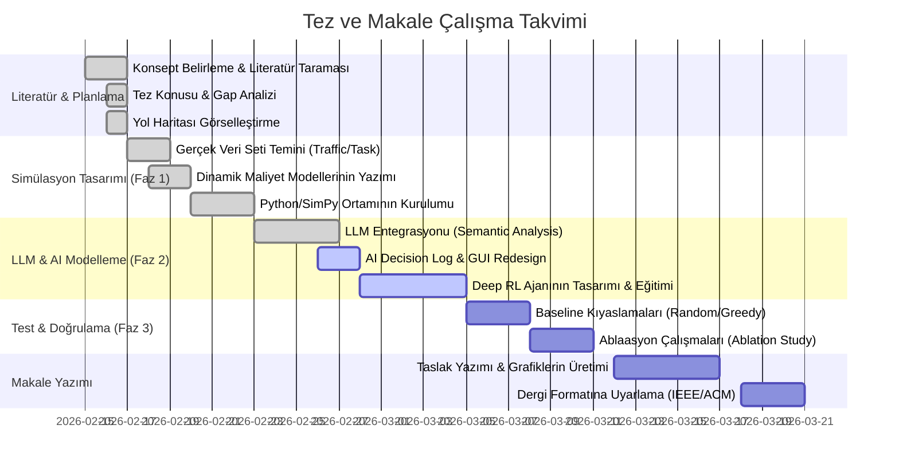

# Araştırma ve Tez Yol Haritası (Roadmap)

Bu dosya, "LLM-Empowered Semantic Task Offloading" tezi için izlenecek adımları görselleştirir.

## Proje Zaman Çizelgesi ve Akış Şeması



## Sistem Mimarisi ve İş Akışı

Aşağıdaki şema, gerçekleştireceğimiz simülasyonun mantıksal akışını gösterir:

```mermaid
flowchart TD
    subgraph InputLayer ["1. Data & State Injection"]
        direction LR
        A1["Google Cluster Trace (Task Bits/Cycles)"] -->|"Task Specs"| B
        A2["User Mobility (Distance/SNR)"] -->|"Physical State"| B
        A3["Real-time Battery %"] -->|"Energy State"| B
    end

    subgraph IntelligenceLayer ["2. AI & Semantic Core (The Brain)"]
        direction TB
        B["Simulator Environment (SimPy)"] -->|"Raw Task"| C["LLM Semantic Analyzer"]
        C -->|"Priority (0-1), Complexity"| D{"Decision Engine"}
        
        subgraph RL_Logic ["Deep Reinforcement Learning (PPO)"]
            E["State Vector S(t)"] -->|"SNR, Load, Battery, Cycles"| F["PPO Agent (Policy)"]
            F -->|"Action A(t): [L, E, C]"| G["Action Decoder"]
        end
        
        D -->|"Rule-based Flow"| E
        G -->|"Final Choice"| H["Offloading Executor"]
        
        subgraph Reward_Shaping ["LLM-Guided Reward Shaping"]
            H -->|"Delay/Energy Outcome"| J["Reward Calculator"]
            C -->|"Priority Multiplier"| J
            J -->|"Shaped Reward R(t)"| F
        end
    end

    subgraph InfrastructureLayer ["3. Multi-Tier Execution"]
        direction LR
        H -- 0: Local --> K["IoT CPU (DVFS Model)"]
        H -- 1: Edge --> L["Edge Server (M/M/1 Queue)"]
        H -- 2: Cloud --> M["Cloud Center (Infinite Cap)"]
    end

    subgraph MetricsLayer ["4. Performance Tracking"]
        K & L & M --> N["Metrics Collector"]
        N -->|"Latency/Energy/QoE"| O["GUI Dashboard"]
        N -->|"Decision Trace"| P["Semantic Decision Feed"]
    end

    %% Parameter Flow Annotations
    style RL_Logic fill:#1a2a4a,stroke:#00ffff,color:#fff
    style Reward_Shaping fill:#2a1a4a,stroke:#ff00ff,color:#fff
## Sistem İş Akışı: Adım Adım Derinlemesine Bakış

Şemada görülen karmaşık yapıyı, bir görevin sistemdeki yolculuğu üzerinden adım adım açıklayalım:

### 1. Adım: Veri ve Durum Entegrasyonu (Input Layer)
Her şey bir "Görevin" (Task) oluşmasıyla başlar.
*   **Neden?**: Sistemin neyi çözeceğini anlaması gerekir.
*   **Nasıl?**: `Google Cluster Trace` verileri kullanılarak rastgele ama gerçekçi görevler üretilir. Görevin boyutu (bits) ve işlemci ihtiyacı (cycles) belirlenir. Aynı zamanda `Mobility Manager`, cihazın o anki konumunu ve baz istasyonuna (Edge) olan uzaklığını hesaplar.

### 2. Adım: Semantik Anlamlandırma (LLM Analyzer)
Üretilen görev, karar mekanizmasına gitmeden önce **LLM Semantic Analyzer**'a uğrar.
*   **Neden?**: Her 1 MB'lık görev aynı değildir. Biri acil bir sağlık uyarısı (Critical) iken diğeri sadece bir günlük (Log) olabilir.
*   **Nasıl?**: LLM, görevin tipine bakarak ona 0-1 arasında bir **Öncelik Skoru** atar. Bu skor, sonraki adımlarda verilecek kararın "şiddetini" belirler.

### 3. Adım: Yapay Zeka Karar Mekanizması (PPO Agent)
Artık elimizde görevin özellikleri ve ağın durumu var. Burada **PPO (Deep RL) Ajanı** devreye girer.
*   **Neden?**: Klasik yöntemler (Greedy) sadece o anki en iyiye odaklanır. PPO ise gelecekteki ödülleri de düşünerek "akıllı" bir politika izler.
*   **Nasıl?**: 
    - **S(t) State Vector**: Ajan; SNR (sinyal kalitesi), batarya yüzdesi ve sunucu yükü gibi verileri bir "durum" olarak okur.
    - **A(t) Action**: Ajan bu duruma bakarak üç karardan birini verir: `0: Yerel (Local)`, `1: Edge Server`, `2: Cloud`.

### 4. Adım: Ödül Şekillendirme (Reward Shaping)
Ajanın verdiği kararın iyi mi kötü mü olduğu burada ölçülür. Burada **LLM Destekli Ödül Şekillendirme** kullanılır.
*   **Neden?**: Yapay zekaya "Gecikme kötü bir şeydir" demek yetmez. "Kritik bir görevdeki 1 saniyelik gecikme, normal görevdeki 100 saniyeden daha kötüdür" dememiz gerekir.
*   **Nasıl?**: LLM'den gelen öncelik skoru, ceza puanıyla çarpılır. Eğer ajan kritik bir görevi geciktirirse çok büyük bir eksi puan (Penalty) alır ve bir daha bu hatayı yapmamayı öğrenir.

### 5. Adım: Fiziksel Modeller ve Yürütme (Infrastructure)
Karar verildikten sonra fiziksel dünya devreye girer.
*   **Neden?**: Teorik kararı gerçek dünyaya bağlamak için.
*   **Nasıl?**:
    - **Local**: Cihaz kendi işlemcisini kullanır, `DVFS Modeli` ile frekansı ayarlar ve batarya harcar.
    - **Edge/Cloud**: Veri havadan gönderilir. `Shannon Formülü` ile o anki gerçek veri hızı (Mbps) hesaplanır. Sunucuda `M/M/1 Kuyruk Modeli` ile bekleme süreleri eklenir.

### 6. Adım: Takip ve Görselleştirme (Metrics & GUI)
Tüm bu matematiksel süreçler kullanıcı için Dashboard'a aktarılır.
*   **Nasıl?**: `Metrics Collector` tüm gecikme ve enerji verilerini toplar. **Dashboard** üzerinde cihazlar hareket ederken, **Decision Feed** panelinde "PPO Ajanı bu kararı şu sinyal kalitesi ve LLM önceliğiyle verdi" şeklinde detaylı raporlar akar.

