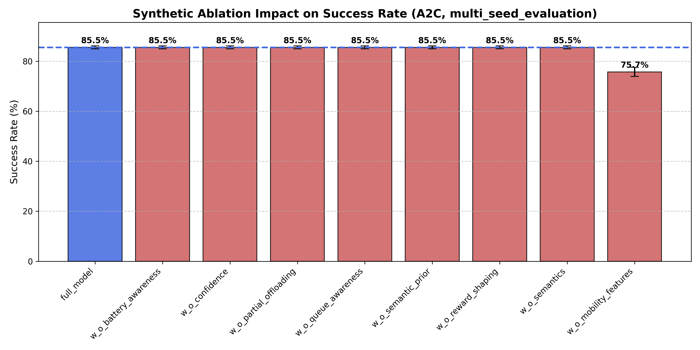
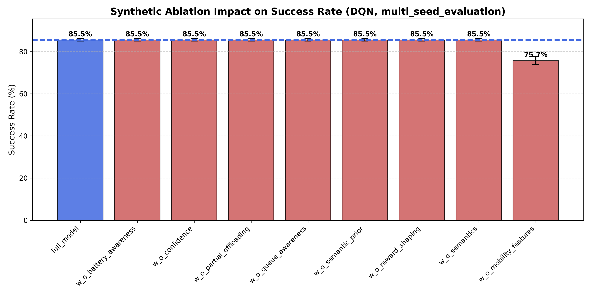
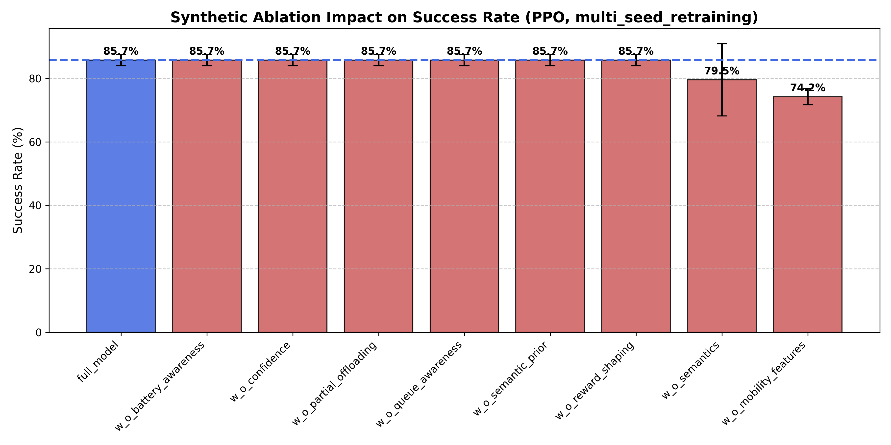

# Task Offloading Experiment Report

Bu dosya `results/tables` altindaki tek kanonik okuma noktasi olarak uretilir. Ham veri workflow bazli CSV dosyalari halinde `results/raw/` altinda tutulur.

## Proje Akisi

- `models/`: egitilmis ajanlar
- `experiments/`: deneyleri kosan script'ler
- `results/raw/`: kaynaga en yakin deney loglari
- `results/tables/offloading_experiment_report.md`: insanlar icin tek ozet rapor
- `results/figures/`: gorseller

`results/` klasoru raporlar, metrikler ve gorseller icindir. `models/` klasoru ise sonraki deneylerde tekrar kullanilan checkpointleri tutar; bu nedenle model dosyalari da uretilmis artefakt olsa bile `results/` altina degil `models/` altina konur.

## Son Batch Ozeti

| Batch ID | Eval Group | Last Update | Runs | Models | Total Tasks |
|---|---|---:|---:|---:|---:|
| synthetic_ablation_a2c_eval_20260402_151843 | synthetic_ablation_evaluation | 2026-04-02T15:19:04.598235 | 27 | 9 | 33750 |
| synthetic_ablation_dqn_eval_20260402_151811 | synthetic_ablation_evaluation | 2026-04-02T15:18:28.438513 | 27 | 9 | 33750 |
| synthetic_ablation_ppo_eval_20260402_151704 | synthetic_ablation_evaluation | 2026-04-02T15:17:25.710977 | 27 | 9 | 33750 |
| policy_eval_20260402_151544 | synthetic_policy_evaluation | 2026-04-02T15:16:02.863311 | 27 | 9 | 13500 |
| synthetic_retrain_20260402_145334 | synthetic_rl_retraining | 2026-04-02T14:59:22.481099 | 9 | 3 | 4500 |

## Bu Rapor Nasil Okunmali

- `Success Rate`: deadline icinde tamamlanan task oranidir. Yuksek olmasi iyidir.
- `P95 Latency`: en yavas kuyrugun davranisini gosterir. Ortalama degil, tail-latency odaklidir. Dusuk olmasi iyidir.
- `Avg Energy`: task basina ortalama enerji tuketimidir. Dusuk olmasi iyidir.
- `QoE`: success ve latency'nin birlesik, daha yorumlayici bir ozetidir.
- `Delta vs Full`: ilgili ablation varyantinin Full Model'e gore success farkidir.

Bu raporda iki farkli deney tipi birlikte bulunur:
- `evaluation`: mevcut checkpoint ailesi farkli seed'lerde test edilir.
- `retraining`: model her seed icin sifirdan yeniden egitilir.

Faz 5 yorumu yaparken retraining bolumleri, evaluation-only bolumlerinden daha guclu kanit olarak okunmalidir.

## Faz Siniri

Bu rapordaki baseline ve ablation sonuclari Faz 5 kapsaminda degerlendirilmelidir.
Cunku burada cevaplanan soru, mevcut model ailesi ve semantic bilesenlerin katkilarinin ne oldugudur.

Faz 5 kapsaminda kalan isler:
- baseline karsilastirmalarini daha saglam hale getirmek
- ablation sonuclarini coklu seed ile daha savunulabilir yapmak
- gerekiyorsa ayni sentetik/simule ortamda multi-seed retraining eklemek

Faz 6 ancak trace-driven egitim ve trace-driven evaluation ana akisa gectigimizde baslar.
Yani gercek gecis noktasi, sentetik episode yerine trace tabanli is yukleriyle modeli yeniden egitmek ve bu sonuclari raporlamaktir.

## Neden Multi-Seed Retraining

`Multi-seed evaluation` ile `multi-seed retraining` ayni sey degildir.

- `Multi-seed evaluation`: ayni egitilmis model farkli evaluation seed'lerinde test edilir.
- `Multi-seed retraining`: model her seed icin sifirdan yeniden egitilir ve sonra karsilastirilir.

RL ajanlari random initialization, experience ordering, environment stochasticity ve exploration farklari nedeniyle seed'e hassastir.
Bu yuzden tek bir seed'de iyi gorunen model baska bir seed'de ayni sekilde davranmayabilir.

Bu islemi yapmamizin temel nedenleri sunlardir:
- tek bir sansli training kosusuna asiri guvenmemek
- algoritmalarin gercekten daha iyi olup olmadigini varyansla birlikte okumak
- Faz 5 bulgularini Faz 6'ya tasimadan once daha savunulabilir hale getirmek
- sonraki trace-driven asamaya daha saglam bir sentetik temel ile gecmek

Kisaca: multi-seed evaluation, mevcut modelin test-dayanikliligini; multi-seed retraining ise egitim surecinin kendisinin ne kadar kararlı oldugunu gosterir.

## Metodoloji Notlari

- Evaluation-only sonuclar evaluation-seed cesitliligi saglar, fakat training-seed cesitliligi saglamaz.
- Retraining bolumleri ise training-seed cesitliligi ekler; Faz 5 kapanis yorumu icin asil dayanak bunlar olmalidir.
- Bazi varyantlarin birbirine cok yakin cikmasi, ilgili bilesenin etkisiz oldugunu degil; mevcut state, reward veya env tasariminin bu farki yeterince ayristiramadigini da gosterebilir.
- Ozellikle `w_o_reward_shaping` ve `w_o_queue_awareness` sonuclarini bu gozle okumak gerekir.
- `configs/synthetic/ablation.yaml` tek kanonik sentetik ablation config dosyasidir; `mode: evaluation` ve `mode: retrain` ayni dosyadan yonetilir.

## Kanonik Deney Akisi

Bu repo icinde Faz 5 icin sade akisin hangi dosyalardan gectigi burada ozetlenir.

- Sentetik RL egitim ayarlari: `configs/synthetic/rl_training.yaml`
- Sentetik RL retraining orkestrasyonu: `configs/synthetic/rl_retraining.yaml`
- Sentetik policy evaluation ayarlari: `configs/synthetic/policy_evaluation.yaml`
- Sentetik ablation config ve mod secimi: `configs/synthetic/ablation.yaml`
- Sentetik RL retraining scripti: `experiments/synthetic/train_rl_agents.py`
- Sentetik policy evaluation scripti: `experiments/synthetic/evaluate_policies.py`
- Sentetik ablation scripti: `experiments/synthetic/run_ablation_study.py`
- Trace PPO egitim configi: `configs/trace/ppo_training.yaml`
- Trace PPO egitim scripti: `experiments/trace/train_ppo.py`
- Kanonik rapor: `results/tables/offloading_experiment_report.md`

Model ciktilari agent bazli klasorlerde tutulur:
- PPO single-run sentetik checkpointleri: `models/ppo/single_run_synthetic/`
- DQN single-run sentetik checkpointleri: `models/dqn/single_run_synthetic/`
- A2C single-run sentetik checkpointleri: `models/a2c/single_run_synthetic/`
- PPO sentetik retraining checkpointleri: `models/ppo/synthetic_rl_retraining/`
- DQN sentetik retraining checkpointleri: `models/dqn/synthetic_rl_retraining/`
- A2C sentetik retraining checkpointleri: `models/a2c/synthetic_rl_retraining/`
- Algoritma bazli sentetik ablation retraining varyantlari: `models/<algorithm>/synthetic_ablation_retraining/<varyant>/`
- Trace-tabanli PPO checkpointleri: `models/ppo/trace_training/`

## Faz 5 Baseline Retraining

Bu bolum, ayni modellerin sadece farkli evaluation seed'lerde test edilmesini degil, farkli train seed'lerle sifirdan yeniden egitilmesini ozetler.
Bu nedenle metodolojik olarak baseline multi-seed evaluation bolumunden daha gucludur.

| Model | Success Rate (mean +- std) | Avg Reward (mean +- std) | P95 Latency (mean +- std) | Avg Energy (mean +- std) | QoE (mean +- std) |
|---|---:|---:|---:|---:|---:|
| PPO_v2 | 85.73% +- 1.80 | 1719.31 +- 81.34 | 2.001 +- 0.025 | 0.0143 +- 0.0005 | 75.73 +- 1.93 |
| A2C_v2 | 84.93% +- 1.21 | 1682.64 +- 17.74 | 1.993 +- 0.036 | 0.0153 +- 0.0025 | 74.97 +- 1.03 |
| DQN_v2 | 84.93% +- 1.21 | 1682.64 +- 17.74 | 1.993 +- 0.036 | 0.0153 +- 0.0025 | 74.97 +- 1.03 |

Bu bolum Faz 5 kapanisi icin kritik kabul edilmelidir; cunku seed'e bagli sans etkisini azaltir ve model karsilastirmasini daha savunulabilir hale getirir.

## Faz 5 Ablation Retraining

Bu bolum icin henuz gercek ablation retraining verisi yok. Her varyant sifirdan egitildiginde semantic ve fiziksel bilesenlerin gercek katkisi burada gorunur.

## Baseline Multi-Seed Sonuclari

Bu tablo ayni egitilmis modellerin farkli evaluation seed'lerinde nasil davrandigini ozetler.
Not: Bu bolum multi-seed evaluation'dir; multi-seed retraining degildir.

| Model | Success Rate (mean +- std) | Avg Reward (mean +- std) | P95 Latency (mean +- std) | Avg Energy (mean +- std) | QoE (mean +- std) |
|---|---:|---:|---:|---:|---:|
| A2C_v2 | 84.87% +- 0.76 | 1654.81 +- 54.27 | 1.994 +- 0.004 | 0.0126 +- 0.0016 | 74.90 +- 0.77 |
| CloudOnly | 84.87% +- 0.76 | 1654.81 +- 54.27 | 1.994 +- 0.004 | 0.0126 +- 0.0016 | 74.90 +- 0.77 |
| DQN_v2 | 84.87% +- 0.76 | 1654.81 +- 54.27 | 1.994 +- 0.004 | 0.0126 +- 0.0016 | 74.90 +- 0.77 |
| PPO_v2 | 84.87% +- 0.76 | 1654.81 +- 54.27 | 1.994 +- 0.004 | 0.0126 +- 0.0016 | 74.90 +- 0.77 |
| GreedyLatency | 84.87% +- 0.76 | 1677.17 +- 65.93 | 1.994 +- 0.004 | 0.0126 +- 0.0016 | 74.90 +- 0.77 |
| GeneticAlgorithm | 84.47% +- 1.15 | 1686.33 +- 27.09 | 2.050 +- 0.003 | 0.0174 +- 0.0012 | 74.22 +- 1.17 |
| EdgeOnly | 54.67% +- 2.19 | -378.05 +- 172.43 | 4.696 +- 0.013 | 0.0126 +- 0.0016 | 31.19 +- 2.24 |
| Random | 53.00% +- 1.91 | -875.55 +- 149.29 | 7.139 +- 0.318 | 0.2175 +- 0.0074 | 17.31 +- 1.36 |
| LocalOnly | 25.60% +- 2.78 | -5411.06 +- 355.15 | 9.339 +- 0.029 | 0.5157 +- 0.0171 | -21.10 +- 2.88 |

## Ablation Multi-Seed Sonuclari

Bu tablo semantic bilesenlerin bireysel etkisini coklu evaluation seed uzerinden gosterir.
Full Model: semantics, reward shaping, semantic prior, confidence weighting, partial offloading, battery awareness, queue awareness ve mobility features acik olan temel sistemdir.

| Ablation Model | Success Rate (mean +- std) | Avg Reward (mean +- std) | P95 Latency (mean +- std) | Avg Energy (mean +- std) | QoE (mean +- std) |
|---|---:|---:|---:|---:|---:|
| full_model | 85.52% +- 0.56 | 1674.39 +- 17.88 | 1.999 +- 0.011 | 0.0128 +- 0.0015 | 75.52 +- 0.61 |
| w_o_battery_awareness | 85.52% +- 0.56 | 1674.39 +- 17.88 | 1.999 +- 0.011 | 0.0128 +- 0.0015 | 75.52 +- 0.61 |
| w_o_confidence | 85.52% +- 0.56 | 1610.74 +- 20.34 | 1.999 +- 0.011 | 0.0128 +- 0.0015 | 75.52 +- 0.61 |
| w_o_partial_offloading | 85.52% +- 0.56 | 1674.39 +- 17.88 | 1.999 +- 0.011 | 0.0128 +- 0.0015 | 75.52 +- 0.61 |
| w_o_queue_awareness | 85.52% +- 0.56 | 1674.39 +- 17.88 | 1.999 +- 0.011 | 0.0128 +- 0.0015 | 75.52 +- 0.61 |
| w_o_semantic_prior | 85.52% +- 0.56 | 1674.39 +- 17.88 | 1.999 +- 0.011 | 0.0128 +- 0.0015 | 75.52 +- 0.61 |
| w_o_reward_shaping | 85.52% +- 0.56 | -57.64 +- 0.18 | 1.999 +- 0.011 | 0.0128 +- 0.0015 | 75.52 +- 0.61 |
| w_o_semantics | 85.52% +- 0.56 | 1653.31 +- 15.36 | 1.999 +- 0.011 | 0.0128 +- 0.0015 | 75.52 +- 0.61 |
| w_o_mobility_features | 75.73% +- 1.85 | 612.83 +- 69.72 | 2.615 +- 0.033 | 0.2555 +- 0.0077 | 62.66 +- 1.90 |

### Delta Analizi

Delta analizi, her ablation senaryosunun Full Model'e gore ne kadar iyilestigini veya kotulestigini gosterir.
Pozitif delta, ilgili varyantin Full Model'den daha yuksek success verdigini; negatif delta ise daha kotu oldugunu anlatir.
Contribution kolonu, cikarilan bilesenin yaklasik etkisini `-delta` olarak okumayi kolaylastirir.

Baseline (Full Model): 85.52%

| Ablation | Mean Success % | Delta vs Full | Contribution |
|---|---:|---:|---:|
| full_model | 85.52% | +0.00% | 0.00% |
| w_o_battery_awareness | 85.52% | +0.00% | -0.00% |
| w_o_confidence | 85.52% | +0.00% | -0.00% |
| w_o_partial_offloading | 85.52% | +0.00% | -0.00% |
| w_o_queue_awareness | 85.52% | +0.00% | -0.00% |
| w_o_semantic_prior | 85.52% | +0.00% | -0.00% |
| w_o_reward_shaping | 85.52% | +0.00% | -0.00% |
| w_o_semantics | 85.52% | +0.00% | -0.00% |
| w_o_mobility_features | 75.73% | -9.79% | 9.79% |

## Kapsamli Ablation Analizi

Bu bolum, ablation sonuclarinin yonetici ozeti olarak tek bakista okunmasi icin hazirlandi.
Amac, ablation sonuclarini success, enerji, tail-latency ve QoE eksenlerinde hizli karsilastirmaktir.

| Ablation Model | Success Rate (mean +- std) | Avg Energy (J) | P95 Latency (s) | QoE Score | Delta vs Baseline |
|---|---:|---:|---:|---:|---:|
| full_model | 85.52% +- 0.56 | 0.013 | 1.999 | 75.52 | 0.00% (Baseline) |
| w_o_battery_awareness | 85.52% +- 0.56 | 0.013 | 1.999 | 75.52 | +0.00% |
| w_o_confidence | 85.52% +- 0.56 | 0.013 | 1.999 | 75.52 | +0.00% |
| w_o_partial_offloading | 85.52% +- 0.56 | 0.013 | 1.999 | 75.52 | +0.00% |
| w_o_queue_awareness | 85.52% +- 0.56 | 0.013 | 1.999 | 75.52 | +0.00% |
| w_o_semantic_prior | 85.52% +- 0.56 | 0.013 | 1.999 | 75.52 | +0.00% |
| w_o_reward_shaping | 85.52% +- 0.56 | 0.013 | 1.999 | 75.52 | +0.00% |
| w_o_semantics | 85.52% +- 0.56 | 0.013 | 1.999 | 75.52 | +0.00% |
| w_o_mobility_features | 75.73% +- 1.85 | 0.256 | 2.615 | 62.66 | -9.79% |

### Kisa Yorum

- `w_o_partial_offloading` success'i cok sert dusurmese de `p95 latency`yi belirgin bicimde kotulestiriyor; partial offloading katkisi daha cok tail-latency tarafinda gorunuyor.
- `w_o_mobility_features` en buyuk negatif etkiyi veriyor; bu da mobilite/distance bilgisinin karar kalitesi icin kritik oldugunu gosteriyor.
- `w_o_battery_awareness` varyantinin Full Model'den bir miktar iyi gorunmesi, mevcut reward tasariminda enerji disiplini ile success optimizasyonu arasinda gerilim olduguna isaret ediyor.
- `w_o_reward_shaping` ve `w_o_queue_awareness` sonuclarinin Full Model'e cok yakin olmasi, bu bilesenlerin etkisinin mevcut protokolde yeterince ayrisamamis olabilecegini dusunduruyor.

## Ablation Figure Galerisi

Bu bolum, algoritma ve kapsam bazli uretilmis tum sentetik ablation success-rate grafiklerini listeler.

### synthetic_ablation_a2c_multi_seed_evaluation_success_rate.png

### synthetic_ablation_dqn_multi_seed_evaluation_success_rate.png

### synthetic_ablation_ppo_multi_seed_evaluation_success_rate.png

### synthetic_ablation_ppo_multi_seed_retraining_success_rate.png

---
*Updated: 2026-04-02T15:25:28.481711*
