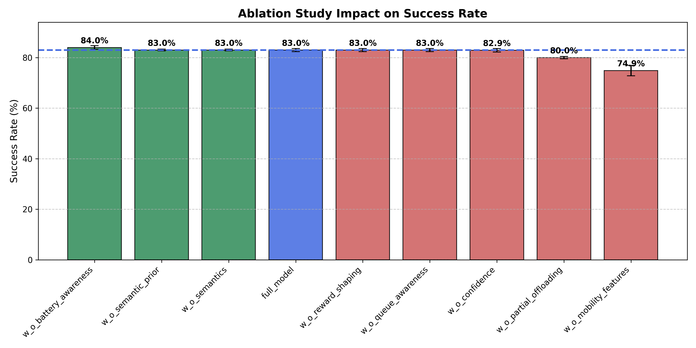

# Task Offloading Experiment Report

Bu dosya `results/tables` altindaki tek kanonik okuma noktasi olarak uretilir. Ham veri kaynagi degismeden `results/raw/master_experiments.csv` icinde tutulur.

## Proje Akisi

- `models/`: egitilmis ajanlar
- `experiments/`: deneyleri kosan script'ler
- `results/raw/`: kaynaga en yakin deney loglari
- `results/tables/offloading_experiment_report.md`: insanlar icin tek ozet rapor
- `results/figures/`: gorseller

## Son Batch Ozeti

| Batch ID | Eval Group | Last Update | Runs | Models | Total Tasks |
|---|---|---:|---:|---:|---:|
| ablation_20260401_152509 | ablation_multiseed | 2026-04-01T15:25:58.268252 | 27 | 9 | 33750 |
| ablation_20260401_152041 | ablation_multiseed | 2026-04-01T15:21:30.571893 | 27 | 9 | 33750 |
| baseline_20260401_152006 | baseline_multiseed | 2026-04-01T15:20:24.038580 | 27 | 9 | 13500 |
| baseline_20260401_151809 | baseline_multiseed | 2026-04-01T15:18:27.286333 | 27 | 9 | 13500 |

## Bu Rapor Nasil Okunmali

- `Success Rate`: deadline icinde tamamlanan task oranidir. Yuksek olmasi iyidir.
- `P95 Latency`: en yavas kuyrugun davranisini gosterir. Ortalama degil, tail-latency odaklidir. Dusuk olmasi iyidir.
- `Avg Energy`: task basina ortalama enerji tuketimidir. Dusuk olmasi iyidir.
- `QoE`: success ve latency'nin birlesik, daha yorumlayici bir ozetidir.
- `Delta vs Full`: ilgili ablation varyantinin Full Model'e gore success farkidir.

Bu rapordaki baseline ve ablation bolumleri su anda agirlikli olarak multi-seed evaluation sonucudur.
Yani ayni egitilmis modeller farkli seed'lerde test edilmistir; bu, farkli seed'lerle yeniden egitilmis olmakla ayni sey degildir.

## Faz Siniri

Bu rapordaki baseline ve ablation sonuclari Faz 5 kapsaminda degerlendirilmelidir.
Cunku burada cevaplanan soru, mevcut model ailesi ve semantic bilesenlerin katkilarinin ne oldugudur.

Faz 5 kapsaminda kalan isler:
- baseline karsilastirmalarini daha saglam hale getirmek
- ablation sonuclarini coklu seed ile daha savunulabilir yapmak
- gerekiyorsa ayni sentetik/simule ortamda multi-seed retraining eklemek

Faz 6 ancak trace-driven egitim ve trace-driven evaluation ana akisa gectigimizde baslar.
Yani gercek gecis noktasi, sentetik episode yerine trace tabanli is yukleriyle modeli yeniden egitmek ve bu sonuclari raporlamaktir.

## Metodoloji Notlari

- Mevcut multi-seed sonuclar evaluation-seed cesitliligi saglar, fakat training-seed cesitliligi saglamaz.
- Bu nedenle sonuclar onceki tek-seed duruma gore daha guvenilir olsa da tam anlamiyla seed-robust kabul edilmemelidir.
- Bazi varyantlarin birbirine cok yakin cikmasi, ilgili bilesenin etkisiz oldugunu degil; mevcut state, reward veya env tasariminin bu farki yeterince ayristiramadigini da gosterebilir.
- Ozellikle `w_o_reward_shaping` ve `w_o_queue_awareness` sonuclarini bu gozle okumak gerekir.

## Baseline Multi-Seed Sonuclari

Bu tablo ayni egitilmis modellerin farkli evaluation seed'lerinde nasil davrandigini ozetler.
Not: Bu bolum multi-seed evaluation'dir; multi-seed retraining degildir.

| Model | Success Rate (mean +- std) | Avg Reward (mean +- std) | P95 Latency (mean +- std) | Avg Energy (mean +- std) | QoE (mean +- std) |
|---|---:|---:|---:|---:|---:|
| A2C_v2 | 84.87% +- 0.76 | 1654.81 +- 54.27 | 1.994 +- 0.004 | 0.0126 +- 0.0016 | 74.90 +- 0.77 |
| CloudOnly | 84.87% +- 0.76 | 1654.81 +- 54.27 | 1.994 +- 0.004 | 0.0126 +- 0.0016 | 74.90 +- 0.77 |
| DQN_v2 | 84.87% +- 0.76 | 1654.81 +- 54.27 | 1.994 +- 0.004 | 0.0126 +- 0.0016 | 74.90 +- 0.77 |
| GreedyLatency | 84.87% +- 0.76 | 1677.17 +- 65.93 | 1.994 +- 0.004 | 0.0126 +- 0.0016 | 74.90 +- 0.77 |
| GeneticAlgorithm | 84.47% +- 1.15 | 1686.33 +- 27.09 | 2.050 +- 0.003 | 0.0174 +- 0.0012 | 74.22 +- 1.17 |
| PPO_v2 | 82.53% +- 0.90 | 2099.92 +- 88.48 | 2.056 +- 0.006 | 0.0380 +- 0.0003 | 72.26 +- 0.93 |
| EdgeOnly | 54.67% +- 2.19 | -378.05 +- 172.43 | 4.696 +- 0.013 | 0.0126 +- 0.0016 | 31.19 +- 2.24 |
| Random | 53.00% +- 1.91 | -875.55 +- 149.29 | 7.139 +- 0.318 | 0.2175 +- 0.0074 | 17.31 +- 1.36 |
| LocalOnly | 25.60% +- 2.78 | -5411.06 +- 355.15 | 9.339 +- 0.029 | 0.5157 +- 0.0171 | -21.10 +- 2.88 |

## Ablation Multi-Seed Sonuclari

Bu tablo semantic bilesenlerin bireysel etkisini coklu evaluation seed uzerinden gosterir.
Full Model: semantics, reward shaping, semantic prior, confidence weighting, partial offloading, battery awareness, queue awareness ve mobility features acik olan temel sistemdir.

| Ablation Model | Success Rate (mean +- std) | Avg Reward (mean +- std) | P95 Latency (mean +- std) | Avg Energy (mean +- std) | QoE (mean +- std) |
|---|---:|---:|---:|---:|---:|
| w_o_battery_awareness | 84.00% +- 0.71 | 2078.81 +- 29.19 | 2.005 +- 0.011 | 0.0274 +- 0.0019 | 73.98 +- 0.76 |
| w_o_semantic_prior | 83.01% +- 0.33 | 2060.81 +- 23.66 | 1.999 +- 0.011 | 0.0356 +- 0.0015 | 73.02 +- 0.38 |
| w_o_semantics | 83.01% +- 0.33 | 2161.91 +- 18.86 | 1.999 +- 0.011 | 0.0356 +- 0.0015 | 73.02 +- 0.38 |
| full_model | 82.99% +- 0.58 | 2133.16 +- 28.28 | 2.058 +- 0.005 | 0.0391 +- 0.0019 | 72.70 +- 0.61 |
| w_o_reward_shaping | 82.99% +- 0.58 | -65.72 +- 0.15 | 2.058 +- 0.005 | 0.0391 +- 0.0019 | 72.70 +- 0.61 |
| w_o_queue_awareness | 82.99% +- 0.58 | 2133.16 +- 28.28 | 2.058 +- 0.005 | 0.0391 +- 0.0019 | 72.70 +- 0.61 |
| w_o_confidence | 82.88% +- 0.69 | 2151.03 +- 29.74 | 2.112 +- 0.015 | 0.0386 +- 0.0022 | 72.32 +- 0.67 |
| w_o_partial_offloading | 79.97% +- 0.45 | 1612.56 +- 9.96 | 2.362 +- 0.006 | 0.0128 +- 0.0015 | 68.16 +- 0.47 |
| w_o_mobility_features | 74.88% +- 2.09 | 894.36 +- 91.49 | 2.618 +- 0.031 | 0.2520 +- 0.0072 | 61.79 +- 2.11 |

### Delta Analizi

Delta analizi, her ablation senaryosunun Full Model'e gore ne kadar iyilestigini veya kotulestigini gosterir.
Pozitif delta, ilgili varyantin Full Model'den daha yuksek success verdigini; negatif delta ise daha kotu oldugunu anlatir.
Contribution kolonu, cikarilan bilesenin yaklasik etkisini `-delta` olarak okumayi kolaylastirir.

Baseline (Full Model): 82.99%

| Ablation | Mean Success % | Delta vs Full | Contribution |
|---|---:|---:|---:|
| w_o_battery_awareness | 84.00% | +1.01% | -1.01% |
| w_o_semantic_prior | 83.01% | +0.03% | -0.03% |
| w_o_semantics | 83.01% | +0.03% | -0.03% |
| full_model | 82.99% | +0.00% | 0.00% |
| w_o_reward_shaping | 82.99% | +0.00% | -0.00% |
| w_o_queue_awareness | 82.99% | +0.00% | -0.00% |
| w_o_confidence | 82.88% | -0.11% | 0.11% |
| w_o_partial_offloading | 79.97% | -3.01% | 3.01% |
| w_o_mobility_features | 74.88% | -8.11% | 8.11% |

### Figure

## Kapsamli Ablation Analizi

Bu bolum, ablation sonuclarinin yonetici ozeti olarak tek bakista okunmasi icin hazirlandi.
Amac, ablation sonuclarini success, enerji, tail-latency ve QoE eksenlerinde hizli karsilastirmaktir.

| Ablation Model | Success Rate (mean +- std) | Avg Energy (J) | P95 Latency (s) | QoE Score | Delta vs Baseline |
|---|---:|---:|---:|---:|---:|
| w_o_battery_awareness | 84.00% +- 0.71 | 0.027 | 2.005 | 73.98 | +1.01% |
| w_o_semantic_prior | 83.01% +- 0.33 | 0.036 | 1.999 | 73.02 | +0.03% |
| w_o_semantics | 83.01% +- 0.33 | 0.036 | 1.999 | 73.02 | +0.03% |
| full_model | 82.99% +- 0.58 | 0.039 | 2.058 | 72.70 | 0.00% (Baseline) |
| w_o_reward_shaping | 82.99% +- 0.58 | 0.039 | 2.058 | 72.70 | +0.00% |
| w_o_queue_awareness | 82.99% +- 0.58 | 0.039 | 2.058 | 72.70 | +0.00% |
| w_o_confidence | 82.88% +- 0.69 | 0.039 | 2.112 | 72.32 | -0.11% |
| w_o_partial_offloading | 79.97% +- 0.45 | 0.013 | 2.362 | 68.16 | -3.01% |
| w_o_mobility_features | 74.88% +- 2.09 | 0.252 | 2.618 | 61.79 | -8.11% |

### Kisa Yorum

- `w_o_partial_offloading` success'i cok sert dusurmese de `p95 latency`yi belirgin bicimde kotulestiriyor; partial offloading katkisi daha cok tail-latency tarafinda gorunuyor.
- `w_o_mobility_features` en buyuk negatif etkiyi veriyor; bu da mobilite/distance bilgisinin karar kalitesi icin kritik oldugunu gosteriyor.
- `w_o_battery_awareness` varyantinin Full Model'den bir miktar iyi gorunmesi, mevcut reward tasariminda enerji disiplini ile success optimizasyonu arasinda gerilim olduguna isaret ediyor.
- `w_o_reward_shaping` ve `w_o_queue_awareness` sonuclarinin Full Model'e cok yakin olmasi, bu bilesenlerin etkisinin mevcut protokolde yeterince ayrisamamis olabilecegini dusunduruyor.

---
*Updated: 2026-04-01T16:29:50.329270*
