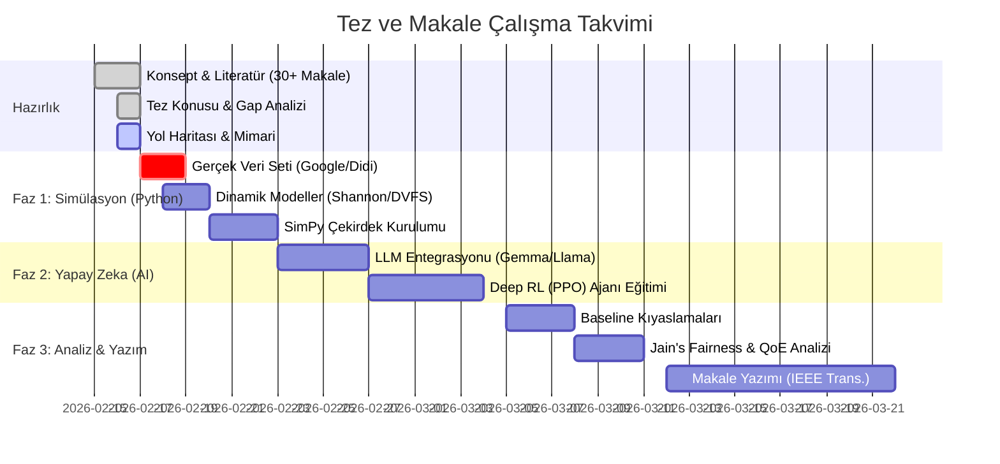
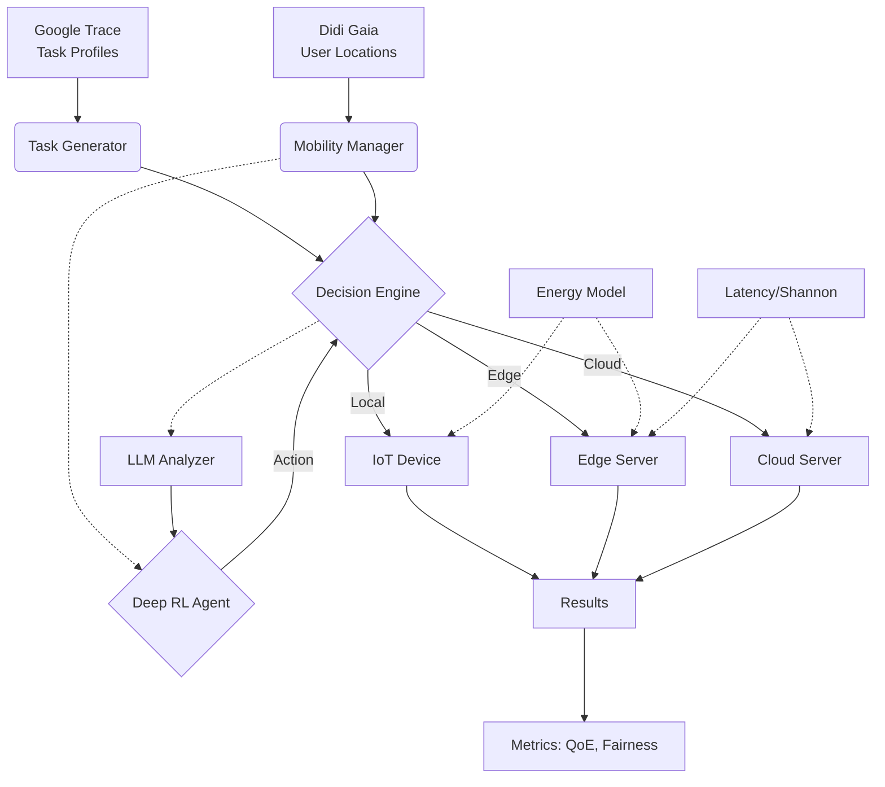

# Araştırma ve Tez Yol Haritası (Roadmap)

Bu dosya, "LLM-Empowered Semantic Task Offloading" projesinin görsel ve metin tabanlı uygulama planıdır.

## 1. Görsel Zaman Çizelgesi (Gantt Chart)

## 2. Sistem Mimarisi (System Architecture)

Sistem; Gerçek Veri, Simülasyon Çekirdeği ve Yapay Zeka Katmanı olmak üzere 3 ana bloktan oluşur.

## 3. Uygulama Adımları (Actionable Plan)

Bu bölüm, projeyi hayata geçirmek için kodlanacak modülleri listeler.

### Adım 1: Temel Simülasyon (`simulation_env.py`)
- [ ] **Data Loaders:** `google_trace_loader.py` ve `mobility_loader.py` (CSV okuma).
- [ ] **Channel Model:** Shannon kapasitesi ile bant genişliği hesaplayan fonksiyon.
- [ ] **Device Class:** Pil durumu ve konumu tutan sınıf.
- [ ] **Edge Server Class:** DVFS destekli işlemci sınıfı.

### Adım 2: Zeka Entegrasyonu (`ai_agent.py`)
- [ ] **LLM Interface:** HuggingFace `AutoModel` ile `prompt engineering` (Task -> Priority).
- [ ] **RL Environment:** Gymnasium (OpenAI Gym) uyumlu özel `Env` sınıfı.
- [ ] **PPO Agent:** `Stable-Baselines3` kütüphanesi ile PPO kurulumu.

### Adım 3: Çalıştırma ve Test (`main.py`)
- [ ] **Senaryo Koşumu:** 100 cihaz ve 5 Edge sunuculu senaryonun başlatılması.
- [ ] **Veri Toplama:** Her saniyenin `csv` olarak kaydedilmesi.
- [ ] **Grafik Çizimi:** `matplotlib` ile Gecikme, Enerji ve Fairness grafiklerinin çizilmesi.
