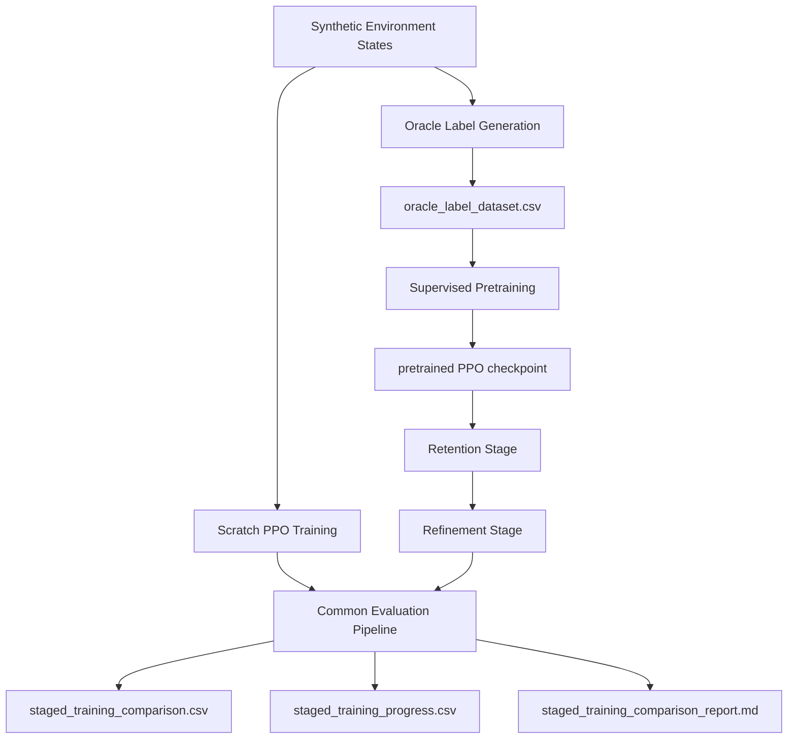

Bkz. ortak kavram sozlugu: v2_docs/project_concepts_glossary.md

# Faz 7 Aciklamasi: Two-Stage Training Calismasinin Uctan Uca Anlatimi

## Bu Dokuman Neden Var

Faz 7 teknik olarak cok verimli ilerledi, ancak ayni anda birden fazla deney varyanti calistigi icin buyuk resim zaman zaman kopuk gorundu.
Bu dokumanin amaci, Faz 7'yi hic bilmeyen birinin bile bastan sona anlayabilecegi aciklikta aciklamaktir.

Bu dokumanda su sorulari cevapliyoruz:

- Faz 7 neden var?
- `two-stage training` tam olarak ne demek?
- `oracle label dataset` nasil uretildi?
- `supervised pretraining` nasil yapildi?
- `RL fine-tuning` neden ikinci asama olarak gerekiyor?
- Faz 7'de neden iki farkli kol var?
- Bu iki kolu neyle kiyasliyoruz?
- Son durumda ne elde ettik?
- Hangi aciklar kapandi, hangileri hala dikkat istiyor?

---

## 1. Faz 7'nin Ana Amaci Nedir

Faz 7'nin ana sorusu su sekilde kurulmustur:

> PPO agent'i her seferinde sifirdan RL ile baslatmak yerine, once bir `teacher policy` ile isitip sonra RL ile gelistirirsek daha iyi bir sonuca ulasabilir miyiz?

Buradaki hedef iki parcaliydi:

1. `sample efficiency`yi arttirmak
2. mumkunse final `success rate` ve genel performansi da yukari tasimak

Yani Faz 7, yalnizca pretraining yapalim demiyor.
Asil soru su:

- `PPO from scratch` mi daha iyi?
- yoksa `Pretrained + PPO` mu daha iyi?

Bu nedenle Faz 7'nin sonunda aslinda iki farkli ogrenme stratejisini kiyasliyoruz.

---

## 2. Faz 7'ye Neden Ihtiyac Duyduk

Faz 5 ve Faz 6 sonunda su tablo ortaya cikti:

- PPO calisiyor
- sentetik ortamda anlamli sonuclar uretiyor
- trace-driven ortamda da genelleme gosterebiliyor
- fakat egitim hala pahali
- policy bazen cok basit bir davranisa, ozellikle `full cloud` secimine, fazla kolay yakinlayabiliyor

Bu nedenle Faz 7'de su fikir test edildi:

Eger policy'ye RL oncesinde anlamli karar ornekleri gosterilirse, agent her seyi sadece reward deneme-yanilmasiyla ogrenmek zorunda kalmayabilir.

Bu, AgentVNE makalesindeki `staged training` fikrinin bu projeye uyarlanmis halidir.

---

## 3. Faz 7'deki Iki Ana Kol

Faz 7 gercekte iki kola ayrilir.
Bu cok onemlidir, cunku tum karsilastirma bunun uzerinden kurulur.

### Kol 1: `Scratch PPO Branch`

Bu kolun amaci su soruya cevap vermektir:

> PPO hicbir `teacher knowledge` almadan, yalnizca RL ile ne kadar iyi ogreniyor?

Bu kolun akisi:

- random initialization
- normal PPO training
- evaluation

Bu kol bizim referans cizgimizdir.
Yani `baseline learning strategy` budur.

### Kol 2: `Pretrained + PPO Branch`

Bu kolun amaci su soruya cevap vermektir:

> PPO once `teacher labels` ile isitilip sonra RL ile gelistirilirse ne oluyor?

Bu kolun akisi:

- `oracle label generation`
- `supervised pretraining`
- `retention stage`
- `refinement stage`
- evaluation

Bu kol bizim `two-stage training strategy`mizdir.

---

## 3.1 Faz 7 Visual Flow

Asagidaki diyagram Faz 7'nin tum akisini tek bakista gosterir.

### Diyagramin Okunusu

Bu diyagram su siranin calistigini anlatir:

1. Sentetik environment state'leri uretilir.
2. Bu state'ler uzerinden bir `teacher policy` ile `oracle labels` uretilir.
3. Bu etiketler `oracle label dataset` haline getirilir.
4. PPO policy network bu dataset ile `supervised pretraining` yapar.
5. Buradan bir `pretrained PPO checkpoint` elde edilir.
6. Daha sonra `pretrained` kolu RL ile `fine-tuning` yapar.
7. Bu `fine-tuning`, iki alt RL asamasina ayrilir:
   - `retention stage`: teacher bilgisinin bir anda silinmemesi icin daha dusuk `learning rate` ve hafif `policy anchoring` ile yapilan ilk RL evresidir.
   - `refinement stage`: policy artik RL reward'a daha rahat uyum saglasin diye anchoring'in gevsetildigi veya kapatildigi ikinci RL evresidir.
8. Ayni anda baska bir kolda `scratch PPO` normal sekilde egitilir.
9. En sonda iki kol ayni `common evaluation pipeline` ile olculur.
10. Karsilastirma CSV'leri ve markdown raporu uretilir.

Kisa not: Diyagramda ayri bir `fine-tuning` kutusu yok gibi gorunebilir. Bunun sebebi, `Retention Stage -> Refinement Stage` zincirinin birlikte zaten `fine-tuning` adimini temsil etmesidir. Yani `fine-tuning`, bu iki RL asamasinin ust kavramidir.
---

## 4. `Oracle Label Dataset` Nedir

Faz 7'de pretraining icin kullandigimiz veri seti harici bir dataset degildir.
Bu dataset proje icinde sentetik environment ustunde uretilmistir.

Guncel artifact:

- `results/raw/synthetic/pretraining/oracle_label_dataset.csv`

Bu dataset su script ile uretilir:

- `experiments/synthetic/generate_oracle_labels.py`

Asil implementation burada bulunur:

- `src/training/pretrain_policy.py`

Kullandigi config:

- `configs/synthetic/oracle_labeling.yaml`

Yani bu dataset, bizim offloading problemimize gore olusturulmus, problem-ozel bir `teacher dataset`tir.

---

## 5. Bu Dataset Nasil Uretildi

Pipeline su sekilde calisir:

1. Sentetik environment kuruluyor:

   - `max_steps = 50`
   - `num_edge_servers = 3`
   - `num_devices = 5`
2. Her episode ve her step icin mevcut observation okunuyor.
3. Tum valid actions sirayla simule ediliyor.
4. Her action icin su degerler tahmin ediliyor:

   - `predicted_delay`
   - `predicted_energy`
   - `predicted_reward`
   - `deadline_met`
   - `semantic_target`
   - `semantic_match`
   - `edge_energy_cost`
   - `edge_energy_ratio`
   - `switching_overhead`
5. Sonra secilen `teacher objective` bu adaylari skorliyor.
6. En iyi action `oracle_action` olarak seciliyor.
7. En iyi action ile ikinci en iyi action arasindaki fark `oracle_margin` olarak kaydediliyor.

Bu margin degeri kritik onemdedir.
Cunku teacher'in kararinin ne kadar net oldugunu anlatir.

---

## 6. Dataset'in Icindeki Alanlar Nelerdir

Dataset su teacher varyantlarini icerir:

- `latency_oracle`
- `energy_oracle`
- `weighted_objective_oracle`
- `reward_aligned_oracle`

Her sample su alanlari tutar:

- `obs_0 ... obs_11`
- `oracle_action`
- `oracle_action_name`
- `oracle_score`
- `oracle_margin`
- `predicted_delay`
- `predicted_energy`
- `predicted_reward`
- `deadline_met`
- `semantic_target`
- `semantic_match`
- `switching_overhead`
- `edge_energy_cost`
- `edge_energy_ratio`
- task metadata
- device battery level
- split bilgisi (`train`, `val`, `test`)

Guncel sayilar:

- total sample: `12000`
- `train = 8400`
- `val = 1800`
- `test = 1800`

---

## 6.1 `Teacher Policy` Nedir

`Teacher policy`, belirli bir state goruldugunde "bu durumda en mantikli action hangisi olmali?" sorusuna otomatik cevap veren ogretmen karar mekanizmasidir.

Bu projede `teacher policy` disaridan alinmis hazir bir model degildir. Bizim sentetik environment icinde, her state icin tum gecerli action'lari tek tek skorlayan ve en iyi adayi sececek sekilde olusturulmus bir kararlayicidir.

Yani pratikte su isi yapar:
- mevcut observation'i alir
- butun valid action'lari dener veya skorlar
- her action icin delay, energy, reward, deadline ve semantic etkileri tahmin eder
- secilen objective'e gore en iyi action'i `oracle_action` olarak etiketler

Bu nedenle `teacher policy`, PPO'ya "dogru cevap" vermekten cok, "iyi bir baslangic davranisi" gosteren ogretmen rolundedir.
## 7. Teacher Variants Neleri Temsil Ediyor

### `latency_oracle`

Bu teacher daha dusuk delay'e odaklanir.
Gozlemledigimiz sey, bunun `cloud` agirlikli bir teacher haline gelmesidir.
Bu nedenle tek basina yeterli degildir.

### `energy_oracle`

Bu teacher daha dusuk energy cost'a odaklanir.
Bu da benzer sekilde `cloud` agirlikli kalmistir.
Bu nedenle dengeli bir `teacher policy` uretmemistir.

### `weighted_objective_oracle`

Bu teacher birden fazla unsuru birlikte degerlendirir:

- normalized delay
- normalized energy
- deadline pressure
- cloud penalty
- battery risk
- edge risk
- semantic alignment
- partial offloading bonuses

Bu teacher ilk anlamli dengeli varyant oldu.
Ozellikle `edge_75` agirlikli bir profile sahip oldu.

### `reward_aligned_oracle`

Bu teacher, secim mantigini downstream RL reward'a daha yakin kurar.
Bu nedenle objective alignment acisindan degerlidir.
Ancak supervised olarak taklit edilmesi daha zordur.

Faz 7'nin onemli bulgularindan biri tam burada ortaya cikti:

> RL objective'e daha yakin olan bir teacher, supervised imitation acisindan her zaman daha kolay olmayabilir.

---

## 8. `oracle_margin` Neden Bu Kadar Onemli Oldu

Zaman icinde su anlasildi:

Her teacher sample ayni kalitede degil.

Baz? state'lerde teacher'in secimi cok nettir.
Bazilarinda ise birden fazla action birbirine yakindir.

Bu nedenle `min_margin` filtresi eklendi.
Bu filtre ile daha kararsiz label'lar ayiklanabilir.

Ama Faz 7'de burada ince bir bulgu daha elde edildi:

- `reward_aligned_oracle` icin margin buyudukce teacher tekrar `cloud` agirlikli hale donebiliyor

Bu da bize sunu ogretti:

> `high-margin` her objective icin otomatik olarak daha iyi teacher anlamina gelmez.

Yani margin filtresi objective'e gore yorumlanmalidir.

---

## 9. `Supervised Pretraining` Bu Projede Nasil Calisiyor

Implementation:

- `src/training/pretrain_policy.py`

Entrypoint:

- `experiments/synthetic/run_supervised_pretraining.py`

Config:

- `configs/synthetic/supervised_pretraining.yaml`

Bu asamada PPO policy network bir siniflandirici gibi egitilir.

Girdi:

- observation vector

Hedef:

- `oracle_action`

Loss:

- cross-entropy over action logits

Kontrol edilen hyperparameter'lar:

- `epochs`
- `batch_size`
- `learning_rate`
- `early_stopping_patience`
- `early_stopping_min_delta`
- `objective`
- `min_margin`

Bu asama sonunda normal PPO biciminde bir checkpoint kaydedilir.
Bu checkpoint daha sonra `fine-tuning` icin kullanilir.

---

## 10. `Supervised Pretraining` Asamasinda Neler Gorduk

Iki ana rejim dikkat cekti.

### Weighted teacher ile pretraining

En iyi gozlenen sonuc:

- validation accuracy: `78.00%`
- test accuracy: `80.22%`

Bu bize weighted teacher'in taklit edilmesi daha kolay oldugunu gosterdi.

### Reward-aligned teacher ile pretraining

Guncel raporlanan sonuc (`min_margin = 10.0` ile):

- best validation accuracy: `59.51%`
- test accuracy: `61.03%`

Bu da reward-aligned teacher'in daha dogru objective'e yakin oldugunu, ama imitation acisindan daha zor oldugunu gosterdi.

Bu nedenle Faz 7'de su fark cok net goruldu:

- `objective alignment`
- `imitability`

Bu ikisi ayni sey degildir.

---

## 11. Pretraining Sonrasinda `Fine-Tuning` Neden Gerekli

Pretraining bittiginde elimizde hazir policy yoktur.
Elimizde sadece daha iyi bir baslangic noktasi vardir.

Daha sonra RL `fine-tuning` baslar:

- ayni environment ailesi
- PPO optimization
- gercek reward
- scratch PPO ile ayni evaluation mantigi

Buradaki esas soru su olur:

> Bu pretrained initialization, random initialization'a gore daha iyi bir learning trajectory uretiyor mu?

---

## 12. Faz 7'nin Kiyaslamasi Tam Olarak Ne Ile Ne Arasinda Kuruldu

Son karsilastirma yalnizca iki model dosyasinin karsilastirilmasi degildir.
Aslinda iki farkli ogrenme stratejisi kiyaslanir:

- `learning from scratch`
- `learning with teacher warm-start`

Model isimleriyle soyle gorunur:

- `PPO_from_scratch`
- `PPO_pretrained_finetuned`

Kullanilan ana artifacts:

- `results/raw/synthetic/staged_training/staged_training_comparison.csv`
- `results/raw/synthetic/staged_training/staged_training_progress.csv`
- `v2_docs/phase_7/staged_training_comparison_report.md`

Olculen baslica metrikler:

- `success rate`
- `avg reward`
- `p95 latency`
- `avg energy`
- `QoE`
- `deadline miss ratio`
- `energy per successful task`
- `step-to-75% success`
- `success curve AUC`
- `success 95% CI`
- action profile

---

## 13. "Pretrained PPO Daha Hizli Isiniyor" Ifadesi Tam Olarak Ne Demek

Bu ifadeyle kastimiz sudur:

> Pretrained policy, scratch PPO'ya gore daha az RL step ile kullanisli bir success bolgesine ulasir.

Bu projede bunu su metrik ile olctuk:

- `step-to-75% success`

Yani bu ifade su anlama gelir:

- pretrained policy ise yarar seviyeye daha erken geliyor
- daha hizli `warm start` aliyor
- ayni budget icinde daha erken verimli hale gelebiliyor

Bu ifade otomatik olarak su demek degildir:

- finalde kesinlikle daha iyi olacak
- latency mutlaka dusuk olacak
- energy mutlaka daha iyi olacak

Yani `faster heating up` = `better early learning`, ama `guaranteed better final result` degildir.

---

## 14. Faz 7'nin Son Durumu: Artik Parity'nin de Uzerine Gectik mi

Evet. Son `retention -> refinement` schedule ile, Faz 7 ilk kez final `success rate` acisindan da `scratch PPO` uzerine cikti.

Guncel 3-seed sonuc:

- `PPO_from_scratch`

  - success: `83.67% +- 0.76`
  - p95 latency: `2.006 +- 0.029`
  - avg energy: `0.0140 +- 0.0016`
  - QoE: `73.64 +- 0.90`
- `PPO_pretrained_finetuned`

  - success: `84.60% +- 0.80`
  - p95 latency: `2.010 +- 0.018`
  - avg energy: `0.0146 +- 0.0022`
  - QoE: `74.55 +- 0.87`

Bunun anlami su:

- staged training artik sadece parity saglamiyor
- final `success rate` tarafinda da olumlu bir fark gostermeye basladi
- yani Faz 7'nin koydugu yuksek hedefe ilk kez daha dogrudan yaklasmis olduk

---

## 14.1 Bu Sonucu Ureten Kanonik Branch Hangisiydi

Bu noktadaki `84.60%` sonuc, herhangi bir teacher ile elde edilmedi.
Kullandigimiz tam kanonik branch su oldu:

- selected teacher policy: `reward_aligned_oracle`
- pretrained checkpoint: `models/ppo/pretrained/ppo_reward_aligned_pretrained.zip`
- retention stage: `10000` step, `learning_rate = 5e-05`, hafif `policy anchoring`
- refinement stage: `20000` step, `learning_rate = 1.5e-04`, anchoring kapali

Yani final ustunluk veren branch, `weighted teacher` degil, `reward-aligned teacher + staged fine-tuning schedule` olmustur.

---

## 14.2 Bu Sonuc Gereksinimi Tam Olarak Karsiliyor mu

Kismen evet, tamamen degil.

Faz 7'nin cekirdek gereksinimi suydu:
- `Pretrained + PPO`, `Scratch PPO`'dan daha hizli ogrenebilmeli
- ve mumkunse final `success rate`te de onu gecebilmeli

Su an bu iki hedef de temel seviyede karsilanmis durumda:
- daha hizli ogrenme gosterildi
- final `success rate`te `84.60% > 83.67%` farki gosterildi

Ama hala tam cozulmemis bir davranissal sinir var:
- hem scratch hem pretrained tarafi finalde buyuk oranda `full cloud` attractor'a yakinliyor
- yani `partial offloading` davranisi final policy'nin baskin ozelligi haline gelmis degil

Bu ne anlama gelir:
- Faz 7'nin `staged training works` kismini destekliyoruz
- ama `staged training bizi belirgin bicimde daha zengin bir offloading davranisina goturdu` demek icin erken

Dolayisiyla Faz 7 su an gereksinimi minimum basari cizgisinin uzerinde karsiliyor, fakat davranissal ayrisma ve `partial offloading retention` hala acik bir iyilestirme alani olarak duruyor.
## 15. Bu Son Sonuc Nasil Yorumlanmali

Dogru yorum sunun kombinasyonudur:

1. `Pretrained + PPO`, erken ogrenmede daha hizli ilerliyor.
2. Son `retention -> refinement` schedule ile final `success rate`te de `scratch PPO`yu geciyor.
3. Ancak butun metriklerde mutlak ustunluk yok.
4. Hala `full cloud` attractor tamamen kirilmis degil.

Yani Faz 7 artik su noktaya geldi:

- `sample efficiency advantage` gosterildi
- final success ustunlugu de ilk kez gosterildi
- fakat policy behavior tarafinda hala tam yapisal ayrisma yok

Bu cok daha guclu bir sonuctur.

---

## 16. Sonucu Iyilestirmek Icin Faz 7 Icinde Neler Denendi

Faz 7 tek deney olmadi; iteratif bir `research loop` haline geldi.

Denenen ana rafinmanlar:

1. `weighted teacher + default fine-tuning`
2. `weighted teacher + lower fine-tuning learning rate`
3. `reward-aligned teacher + lower learning rate`
4. `reward-aligned teacher + aggressive policy anchoring`
5. `reward-aligned teacher + light policy anchoring`
6. `retention -> refinement` two-stage fine-tuning schedule

En son guclu adim su oldu:

- once kisa bir `retention stage`
- sonra ana `refinement stage`

Bu schedule sayesinde, tek seed pilotta gordugumuz final avantaj 3 seed protokolde de desteklenmeye basladi.

---

## 17. Faz 7 Bize Simdiden Neyi Kanitladi

Faz 7 artik su bulgulari guvenle soyleyebilecek noktada:

1. Tam bir `oracle -> pretraining -> fine-tuning -> comparison` pipeline kuruldu.
2. `teacher policy` secimi kritik.
3. `objective alignment` ve `imitability` farkli kavramlar.
4. Two-stage training olculebilir bir `warm-start` etkisi sagliyor.
5. Uygun schedule ile final `success rate` avantajina da ulasilabiliyor.
6. Hala dikkat edilmesi gereken ana sinir `action collapse` ve `cloud attractor` etkisi.

Bu nedenle Faz 7, artik yalnizca ?guzel fikir? seviyesinde degil; deneysel olarak savunulabilir bir asamaya gelmis durumda.

---

## 18. Faz 7'yi En Sade Dille Ozetlersek

Projeyi ilk kez goren biri icin Faz 7'nin ozet c?mlesi sunlar olur:

- Once problem icin `teacher labels` urettik.
- Sonra PPO'yu bu etiketlerle isitacak sekilde egittik.
- Daha sonra ayni PPO'yu RL ile gelistirdik.
- Sonunda bunu `PPO from scratch` ile kiyasladik.
- Ilk denemelerde sadece erken-learning avantaji gorduk.
- Son `retention -> refinement` schedule ile final `success rate`te de ustunluk sinyali aldik.

Yani Faz 7'nin en guncel hikayesi su:

> `Two-stage training`, bu projede hem daha hizli ogrenme hem de uygun schedule ile daha yuksek final success icin anlamli bir yol olarak gorunmeye basladi.

---

## 19. Bu Faz Hangi Sirayla Okunmali

Faz 7'yi en temiz sirada okumak icin su akisi kullan:

1. `v2_docs/phase_7/phase_7_explaination_of_studies.md`
2. `v2_docs/phase_7/phase_7_Two_Stage_Training_plan.md`
3. `phase_reports/Phase_7_Report.md`
4. `v2_docs/phase_7/synthetic_oracle_label_summary.md`
5. `v2_docs/phase_7/supervised_pretraining_report.md`
6. `v2_docs/phase_7/staged_training_comparison_report.md`

Bu siralama seni su cizgide tasir:

- kavramsal cerceve
- plan
- implementation sonucu
- destekleyici artifacts

